# quikleaf

[](LICENSE)
[](https://www.npmjs.com/package/quikleaf)
[](https://github.com/deftio/quikleaf/actions/workflows/ci.yml)
[](https://codecov.io/gh/deftio/quikleaf)

A standalone, cross-platform local markdown editor with rich rendering and LLM chat integration.

Built with [Tauri v2](https://tauri.app) and powered by [quikdown](https://github.com/deftio/quikdown).



## Features

- **Rich Markdown Rendering** — Powered by [quikdown](https://github.com/deftio/quikdown) standalone bundle with support for syntax highlighting, Mermaid diagrams, Math/LaTeX, GeoJSON maps, 3D STL viewer, CSV/TSV tables, Vega/Vega-Lite charts, ABC music notation, SVG, and more — all rendered locally without external services.

- **LLM Chat Integration** — Built-in AI assistant (QD) with streaming responses, 20+ document/memory/KV/file tools, slash commands, and a tool-calling loop with stop button. Supports OpenAI-compatible APIs (Ollama, OpenRouter, LM Studio, Groq) and Anthropic Claude. Auto-detects local Ollama and LM Studio.

- **Project Mode** — Open a folder with `--project ./dir` to get a file tree sidebar, project-scoped file tools, persistent memory/KV store, and project state saving.

- **Native Desktop App** — Fast startup, low memory, native file dialogs, CLI support, keyboard shortcuts, auto dark mode, resizable panels. Cross-platform: macOS, Windows, Linux.

## Quick Start

```bash
# Install dependencies
npm install

# Run in development mode
npm run tauri:dev

# Build production installers
npm run tauri:build
```

### Pre-built Releases

Download installers from the [Releases](https://github.com/deftio/quikleaf/releases) page:

| Platform | Format |
|----------|--------|
| macOS (Apple Silicon) | `.dmg` |
| macOS (Intel) | `.dmg` |
| Windows | `.msi` / `.exe` |
| Linux | `.deb` / `.AppImage` |

## Usage

### Simple Mode (single file)

```bash
quikleaf                    # Open empty editor
quikleaf document.md        # Open a file
```

### Project Mode (folder)

```bash
quikleaf --project ./mydir  # Open folder with file tree and project tools
```

Project mode enables:
- File tree sidebar
- File read/write/list/stat tools for the LLM
- Persistent memory and key-value store
- Project state saved to `quikleaf.prj`

### Keyboard Shortcuts

| Shortcut | Action |
|----------|--------|
| `Cmd/Ctrl + O` | Open file |
| `Cmd/Ctrl + S` | Save file |
| `Enter` (in chat) | Send message |
| `Shift + Enter` (in chat) | New line |

### Chat Slash Commands

| Command | Description |
|---------|-------------|
| `/help` | Show available commands |
| `/clear` | Clear chat history |
| `/model` | Show current LLM model |
| `/memory` | Show scratchpad contents |
| `/tools` | List available tools |

## LLM Configuration

Click **Settings** in the title bar, or let quikleaf auto-detect a local Ollama or LM Studio instance.

### Example Configurations

**Local Ollama:**
```
Provider: OpenAI-compatible
Host: http://localhost:11434/v1
API Key: (leave blank)
Model: llama3.2
```

**Anthropic Claude:**
```
Provider: Anthropic
Host: https://api.anthropic.com
API Key: sk-ant-...
Model: claude-sonnet-4-20250514
```

**OpenRouter:**
```
Provider: OpenAI-compatible
Host: https://openrouter.ai/api/v1
API Key: sk-or-v1-...
Model: meta-llama/llama-3.1-70b-instruct
```

## Building from Source

### Prerequisites

- **Node.js** 18+ and npm
- **Rust** 1.70+ ([rustup.rs](https://rustup.rs))
- Platform-specific dependencies (see below)

**macOS:**
```bash
xcode-select --install
```

**Linux (Debian/Ubuntu):**
```bash
sudo apt install -y libwebkit2gtk-4.1-dev build-essential curl wget file \
  libxdo-dev libssl-dev libayatana-appindicator3-dev librsvg2-dev
```

**Windows:**
- Visual Studio 2022 with "Desktop development with C++" workload

### Build Commands

```bash
npm install                 # Install frontend deps
npm run dev                 # Vite dev server (frontend only)
npm run tauri:dev           # Full dev mode with hot reload
npm run tauri:build         # Production build with installer
npm run check               # TypeScript type checking
cd src-tauri && cargo check # Rust compilation check
```

### Build Output

- **macOS**: `src-tauri/target/release/bundle/dmg/`
- **Windows**: `src-tauri/target/release/bundle/nsis/`
- **Linux**: `src-tauri/target/release/bundle/deb/`, `appimage/`

## Architecture

```
src-tauri/              Rust backend (Tauri v2)
  src/commands/
    fs.rs               File I/O commands
    llm.rs              LLM API proxy with streaming
    project.rs          Project state, memory, KV, file tools
  src/main.rs           CLI parsing, app setup, asset protocol
  src/lib.rs            Library entry point (mirrors main.rs)

src/                    TypeScript frontend (Vite)
  editor/editor.ts      quikdown editor wrapper
  chat/chat-ui.ts       Chat UI, tool dispatch, slash commands
  chat/providers.ts     LLM provider adapters (OpenAI, Anthropic)
  settings/settings.ts  LLM config UI, auto-detect
  project/file-tree.ts  Project mode file tree sidebar
  main.ts               App init, file ops, project mode

index.html              App shell with all CSS
```

### Key Design Decisions

- LLM operates on raw markdown only — never sees or produces HTML
- LLM API calls proxied through Rust backend to avoid CORS and protect API keys
- quikdown standalone bundle includes all fence renderers (~8MB) for offline use
- Tool-calling loop with 60s timeout per call and user-accessible stop button

## Troubleshooting

**macOS: "quikleaf is damaged and can't be opened"**
```bash
xattr -cr /Applications/quikleaf.app
```

**LLM not responding:** Check endpoint is reachable, API key is correct, and model name matches. For Ollama, ensure `ollama serve` is running.

**Tool calls hanging:** Click the red "Stop" button, or try a different model. Some smaller models don't handle tool calling well.

## License

BSD 2-Clause License. Copyright (c) 2026 deftio.

See [LICENSE](LICENSE) for details.

## Links

- [quikleaf on GitHub](https://github.com/deftio/quikleaf)
- [quikdown on GitHub](https://github.com/deftio/quikdown)
- [Issues](https://github.com/deftio/quikleaf/issues)
- [Full Specification](dev/quikleaf-spec.md)
